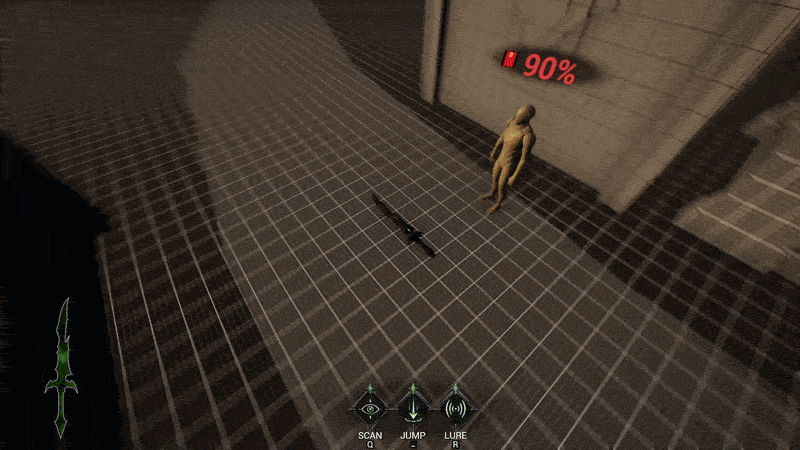

# WieldPhysicsWeaponPawn Code Sample

## Overview


This repository contains the gameplay code for the weapon-controlled player pawn used in Wielderless, a multiplayer Unreal Engine action roguelite. Rather than controlling a traditional character, players inhabit a cursed weapon that moves independently before possessing NPC hosts. The sample demonstrates how gameplay, networking, physics, and presentation are organized into a maintainable Unreal C++ architecture.

The system belongs to a possession-based gameplay loop where the player can move as a weapon, interact with nearby hosts, and transition into a host character. This sample focuses on the weapon-form side of that loop and demonstrates how a complex gameplay pawn can be organized into maintainable implementation domains while preserving Unreal reflection, Blueprint-facing properties, and replicated state.

## See the Full Project

This repository contains a focused code sample from **Wielderless**.

For gameplay videos, system breakdowns, and a complete technical overview, visit my portfolio:

[▶️ Portfolio: https://...](https://jplatte23.github.io/wielderless.html)

## Architecture

`AWieldPhysicsWeaponPawn` remains a single Unreal `APawn` class, with reflected properties, RPC declarations, component references, and Blueprint-facing API defined in `WieldPhysicsWeaponPawn.h`. The implementation is split across several `.cpp` files by responsibility rather than concentrated in one large source file.

`WieldPhysicsWeaponPawn.cpp` contains construction, lifecycle, input binding, replication registration, controller setup, cleanup, and weapon-definition application.

`WieldPhysicsWeaponPawn_MovementSystem.cpp` owns physics body setup, movement input flow, hop behavior, grounded checks, floor recovery, velocity control, and ground-contact feedback.

`WieldPhysicsWeaponPawn_CameraSystem.cpp` owns camera rotation, zoom behavior, camera rig updates, and camera handoff helpers used when transitioning between weapon and host control.

`WieldPhysicsWeaponPawn_AbilitySystem.cpp` owns scan, lure, charm flow, possession prompts, cooldown UI RPCs, projectile spawning, tether VFX, and host lookup.

`WieldPhysicsWeaponPawn_VisualSystem.cpp` owns visible weapon mesh smoothing, material glow updates, mesh scale helpers, and weapon transform accessors.

This structure keeps the class identity stable for Unreal and Blueprint serialization while making the implementation easier to review, maintain, and extend.

## Technical Highlights

- Splits one complex gameplay pawn into responsibility-focused implementation files without changing the reflected Unreal class.
- Separates simulation from presentation using a hidden physics mesh and a smoothed visible weapon mesh.
- Uses server RPCs for gameplay requests such as movement input, hopping, scanning, lure casting, lure hold state, and possession attempts.
- Uses multicast and client RPCs for presentation events such as scan effects, tether VFX, ground-contact audio, camera shake, and cooldown UI.
- Applies weapon-definition data through a centralized path so mesh, movement tuning, gameplay radii, camera settings, and display metadata can be data-driven.
- Preserves camera continuity across possession transitions by exposing helpers to capture and seed camera view state.
- Keeps gameplay state changes such as lure damage, charm state, sacrifice eligibility, and possession resolution on authority paths.
- Includes defensive physics support such as grounded checks, floor tracing, recent safe-ground recovery, velocity clamping, damping, and contact sound throttling.

## Design Decisions

The pawn remains a single `APawn` class rather than being fully decomposed into separate `UActorComponent` classes. This preserves Blueprint compatibility and serialized tuning data while still improving maintainability through implementation-level separation.

The visible weapon mesh is separate from the physics mesh because replicated physics can introduce visible jitter. The physics mesh owns collision and simulation, while the visual mesh interpolates toward the physics transform for cleaner presentation.

Gameplay authority is intentionally separated from presentation. Clients capture input and update local-facing feedback, but server paths handle damage, charm state, scan application, sacrifice eligibility, and possession attempts.

Weapon behavior is data-driven through `UWieldWeaponDefinition`. This allows the same pawn implementation to support different weapon meshes, movement settings, camera profiles, and gameplay tuning without hard-coding those values into control flow.

The split `.cpp` structure is a pragmatic Unreal refactor. It makes the code easier to read in a portfolio context while avoiding the migration risk of moving reflected state into new component classes.

## Skills Demonstrated

- Unreal Engine C++ gameplay programming
- Multiplayer-aware gameplay architecture
- Server-authoritative state management
- RPC design
- Replicated state
- Physics-driven movement
- Camera systems
- Input handling
- Data-driven gameplay tuning
- Object-oriented design
- Separation of concerns
- VFX/audio/UI integration from C++
- Refactoring large gameplay code for maintainability
- Blueprint-safe code organization

## Folder Structure

```text
Pawns/
  WieldPhysicsWeaponPawn.h
  WieldPhysicsWeaponPawn.cpp
  WieldPhysicsWeaponPawn_MovementSystem.cpp
  WieldPhysicsWeaponPawn_CameraSystem.cpp
  WieldPhysicsWeaponPawn_AbilitySystem.cpp
  WieldPhysicsWeaponPawn_VisualSystem.cpp
